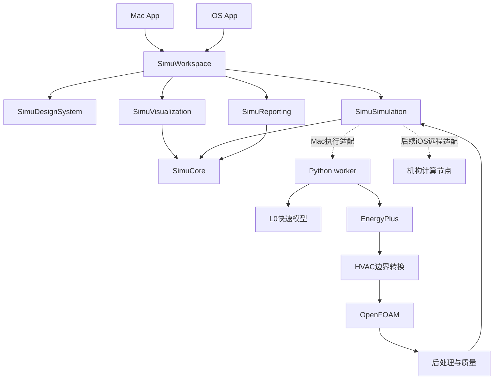

# 系统架构

## 模块与依赖

| 模块 | 当前骨架 | 扩展责任 | 禁止耦合 |
|---|---|---|---|
| Core | draft、坐标、来源、run 身份与状态 | 完整房间 / HVAC / 座位 / 结果契约 | SwiftUI、Process、求解器 |
| Simulation | submit/cancel、未配置实现 | 事件流、结果读取、本地/远程适配 | View、硬编码路径 |
| DesignSystem | EmptyStateView | 语义 token、状态、指标组件 | 计算规则 |
| Visualization | 空视口 | 几何、切片、流线、掩码、坐标转换 | 费用与推荐 |
| Reporting | 导出协议 | 证据汇总、PDF | 重新计算指标 |
| Workspace | Observable store、共享导航 | 工程操作、编辑、任务与比较 | 直接调用 OpenFOAM |

## 状态与并发

UI store 使用 MainActor + Observation。可变任务状态放 actor；跨边界数据为 Codable / Sendable 值类型。
项目编辑模型与输入快照分开。任务终态、质量状态、freshness 三条独立轴；只有当前、质量通过且指标有效的结果用于当前推荐。
单项目 store 当前由各 WindowGroup 初始化；P2 决定文档窗口与项目身份的生命周期，避免窗口状态串用。

## 两端策略

两个原生 target 共用一个本地 Swift Package，按 capability 注入功能。
Mac：全工作区、计算调度、批量、报告；iPad：模型检查、设备标注、结果浏览；iPhone：采集、标注、参数与建议卡。
iOS 不运行外部 Python / Docker / OpenFOAM；通过文件结果或后续用户配置的远程节点使用计算能力。
RoomPlan / ARKit 置于 iOS 适配；Process / NSOpenPanel / 安全书签置于 Mac 适配。平台名称不能代替真正的能力检测。

## 计算与展示

计算原始输出保留在 run 目录。后处理输出平台无关结果 JSON、float32 规则场、有效掩码和折线。
Mac 先使用 RealityKit 几何或独立 MTKView 显示；重采样密度只影响显示，座位定量值从原始求解网格采样。
macOS 14 作为基础；RealityView 在目标 SDK 核对 availability，必要时使用 Mac renderer adapter。提高最低系统版本必须记录 ADR 并同步所有配置与包。

## 后续代码位置

`Backend/src/simunow_worker/` 下新增 `models/`、`jobs/`、`adapters/l0/`、`adapters/energyplus/`、`adapters/openfoam/`、`postprocessing/`、`quality/`、`decision/`。
Swift 按 feature 划分 Workspace 子目录，公共协议留在底层。首次引入真实 adapter 后再拆子包，不提前建立几十个空模块。
