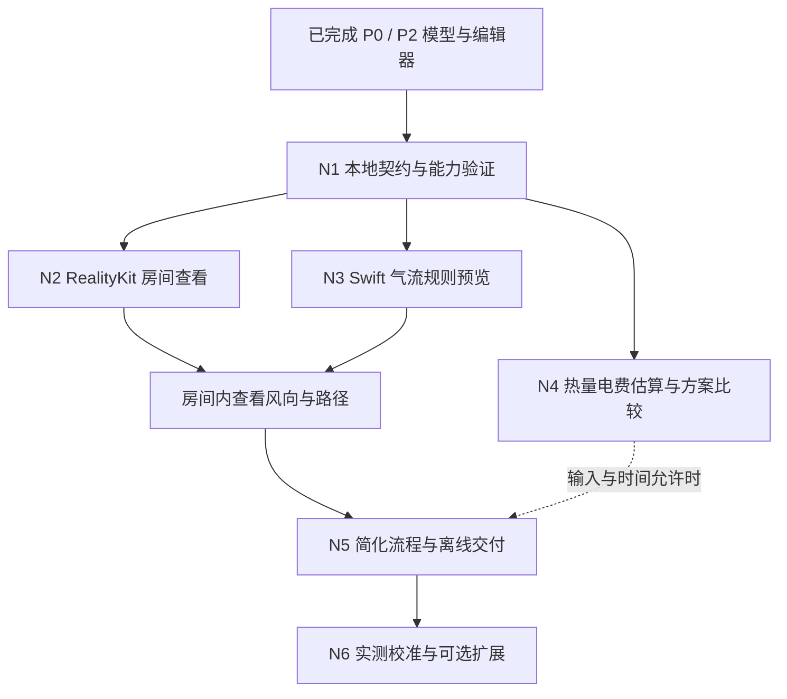

# 开发计划总入口

更新：2026-10-03。当前主线为 **Swift 本地分析 + RealityKit 三维房间查看**。用户无需安装 Python、Linux、Docker、EnergyPlus 或 OpenFOAM。P0/P2继续使用；N1基座、N2房间renderer、N3本地气流规则与N4热量/费用情景估算已整合，正做最终回归与平台审查；本轮用户授权 N5/N6，日常闭环、匿名报告、测量与有界研究代码已接入；[本轮交接](Delivery/N5-N6-implementation.md) 明确 Apple 平台与真实数据待验项。代码、自动验证与实际平台验收分开记录。

产品先帮助用户看懂风向、遮挡和活动位置，比较可执行的运行调整；输入足够时再给出有假设范围的热量和电费估算。规则预览不提供经过 CFD 验证的逐点温度、舒适或节能结论。

## 阅读地图

| 顺序 | 文档 | 内容 |
|---|---|---|
| 1 | [产品与范围](References/01-product-scope.md) | 首版价值、最小输入、结果边界 |
| 2 | [架构](References/02-architecture.md) | 复用 P2、Swift actor、RealityKit 分工 |
| 3 | [交互](References/03-experience-design.md) | 日常调整、三维查看、缺失值与比较 |
| 4 | [数据契约](References/04-data-contracts.md) | 本地请求、结果、哈希和项目兼容 |
| 5 | [计算与决策](References/05-computation-and-decision.md) | 规则预览、集总估算和评价边界 |
| 6 | [排期](References/06-roadmap-and-backlog.md) | 从当前成果出发的依赖和交付切面 |
| 7 | [本地方法规格](References/07-native-method-spec.md) | 算法、输入门槛、退化与验证样例 |
| 8 | [迁移清单](References/08-plan-migration.md) | 旧任务如何保留、替代和延期 |
| 9 | [技术依据](References/09-source-register.md) | 官方资料与 SDK 核对依据 |
| 10 | [AI执行规范](References/10-ai-execution-guide.md) | 接口归属、配置、hash、任务、缓存、保存与交接约定 |
| 11 | [验收案例](References/11-native-acceptance-cases.md) | 92项具体输入/预期结果、人工与自动证据要求 |
| 12 | [验证](Delivery/validation.md)、[平台](Delivery/platform-and-release.md)、[风险](Delivery/risks.md) | 开发与发布门槛 |
| 13 | [状态](Delivery/status.md)、[证据](Delivery/verification.md)、[决策](Delivery/decisions.md)、[验收台账](Delivery/native-acceptance-status.md)、[整合审查](Delivery/native-integration-review.md) | 已实现事实与新路线分开 |
| 14 | [Mac UI 修复清单](UI修复清单.md) | 99 项审查发现、优先级、证据类型、设计方向与验收要求；修复均待处理 |

## 如何逐项执行

N1–N5已细化为27个工作项，每项给出前置、输入/输出、源码接入点、文件归属、执行清单、案例ID与自审门槛。先读共用执行规范，再按相应阶段任务执行，最后对照验收清单记录证据；这些是计划完成，不代表功能已实现。

默认从N1-01/02开始，接口整合后做03/04→05；N2纯场景和N3纯规则可独立推进，显示整合后进入N5。N4为Should，不成为核心闭环的必经前置。多人实施先获得该次授权、指定接口整合人和独立worktree。

## 当前阶段依赖

**当前：N1～N4代码已整合；N4代理交接后，主工作区最终修复的201项共享Swift、完整契约和双端构建均通过。** 实际平台未验收项保留台账。本次用户最新目标为按N1→N2→N3→N4逐类实施，包含这四阶段全部任务；N5及PDF暂不实施；下表优先级保留原规划，不能据此缩减本次范围或提前并行下一类别。

| 工作包 | 定位 | 优先级 |
|---|---|---|
| [P0](Phases/P0-project-foundation.md)、[P2](Phases/P2-room-model-and-editor.md) | 已交付基座；补平台验收 | 保留 |
| [N1](Phases/N1-native-analysis-foundation.md) | 方法契约、就绪度、身份、调度与能力验证 | Must |
| [N2](Phases/N2-realitykit-room-viewer.md) | 房间几何、相机、选择、两端适配 | Must |
| [N3](Phases/N3-local-airflow-preview.md) | 方向场、路径、遮挡、定性比较 | Must |
| [N4](Phases/N4-thermal-estimates-and-comparison.md) | 有依据的热量/电费估算与范围比较 | Should；不作为首版阻断 |
| [N5](Phases/N5-consumer-workflow-and-release.md) | 简化输入、建议卡、保存重开、离线打包 | Must；PDF 为 Should |
| [N6](Phases/N6-calibration-and-extensions.md) | 校准、扫描、可选网格求解或外部复核 | Later |

## 历史计划与维护

原引擎主线保存在 [Archive](Archive/README.md)。P1、P3…P7 的旧 ID 不重新定义；旧路径保留导向页。原 Excalidraw 图为历史路线，新架构以本文和架构文档的 Mermaid 图为准。

本轮用户要求优先于旧计划中“先安装引擎”的建议。现有根 README / AGENTS 的产品描述同步安排在 N1-01，物理与来源硬约束继续有效。`Protocols/` 和现有代码仍描述当前实现，不能把本计划当作已发布协议。

实际状态只写 `Delivery/status.md`；实现某任务时附命令、截图、输入和结果证据。模型方法版本、显示性能目标、现实误差和标准合规各自记录，不互相替代。文档变更不自动执行安装、发布、提交或推送。
