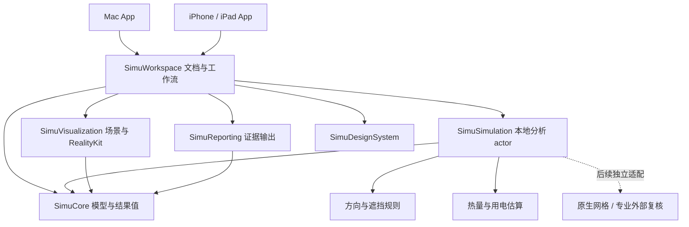

# 系统架构

## 主线与模块

| 模块 | 已有可复用成果 | 本轮路线新增责任 |
|---|---|---|
| SimuCore | Foundation-only v2、语义单位/来源、校验、不可变快照、RunIdentity | 方法、就绪度、分析请求与结果的纯值契约 |
| SimuSimulation | submit/cancel 协议、未配置实现 | 本地 async actor、规则与估算、取消、确定性哈希和缓存 |
| SimuVisualization | Z-up/Apple 坐标转换、俯视投影和对象视图 | 纯 SceneDescriptor、RealityKit entity 增量更新、相机/选择、路径绘制 |
| SimuWorkspace | FileDocument、编辑/undo、模板、基准/候选、导入修复 | 简化入口、按能力就绪度、预览调度、结果归属与比较 |
| SimuReporting | 报告接口 | 消费固定结果证据；不能重新计算或提升结论等级 |
| SimuDesignSystem | 共享空状态 | 方法/缺失/过期/假设的文字与可访问性组件 |
| Apps | 双原生入口与文档生命周期 | 注入本地 client 与 renderer capability；平台文件/分享适配 |
| Backend | v2 Python 契约、runtime manifest/doctor | 保留兼容测试和研发复核工具；不进入消费者启动/预览链路 |

无需新增几十个包。代码按 feature 放在现有模块：Core/Analysis、Simulation/LocalAnalysis、Simulation/AirflowRules、Simulation/ThermalEstimate、Visualization/RoomScene、Visualization/RealityKit、Workspace/Analysis、Workspace/Comparison。这些目录及N1～N4实现现已存在；具体公开接口以Protocols和Delivery/N1…N4-implementation.md为准，N5相关建议/报告尚未实现。

## 计算与渲染分离

1. 工作区捕获不可变输入；独立能力检查决定能做哪种分析。
2. LocalAnalysisClient 仅接收 Sendable 值，执行有限 CPU 工作；actor 用于隔离状态，计算还需显式放在非 MainActor 执行域。循环检查取消并限制点数/步数。
3. 输出方法、假设、路径/定性标签或聚合估算。分析模块不导入 RealityKit，渲染不承担热负荷、成本或推荐。
4. renderer 在 MainActor 创建和更新 Entity；后台只生成纯几何描述/路径点。Entity、FileWrapper、UI binding 不跨计算 actor 传递。
5. RealityKit 负责相机、材质、几何、选择与展示动画。刚体碰撞、ForceEffect、粒子发射器不能作为空气压力/热量求解器。

## 文档与任务状态

DocumentGroup binding 继续作为持久化权威；不另建数据库或第二套几何。共享几何编辑沿用 P2 全方案检查；相机/选择为显示状态。

每次分析保存 run ID、scenario ID、输入哈希、方法版本、实际采用的分析配置、假设和检查。当前编辑 hash、run 归属和完成结果分别管理；旧任务可进入历史，不能写入当前方案视图。

几何查看不等于 inputPreparation；本地预览不使用旧严格“可求解”门槛作为全局阻断。仍必须通过必要结构、单位和安全校验。只有与该方法无关的缺项可忽略；未知几何或设备的排除必须显式列出，不静默遗漏。

## 平台与兼容

首选 RealityView 的虚拟相机进行离线、非 AR 查看；不要求相机、LiDAR 或摄像权限。macOS 15 / iOS 18 起启用该 renderer；当前最低 macOS 14 / iOS 17 保留现有二维查看、编辑和本地分析。依据与 SDK 核对见 [来源登记](09-source-register.md)。

N1-02 先验证两端创建一个房间、orbit、选择和关闭；失败先定位 renderer，而不安装外部求解器。N2 提供 capability 与清楚的二维回退；不为统一接口默认提高最低系统。后续提高最低版本另立 ADR 并同步 Package/xcconfig/生成器。

## 扩展边界

旧 SimulationFidelity.l0…l3 与 request/receipt 不改语义。本地规则预览使用独立 AnalysisMethod/version，不能填成 `.l2` 或宣称 CFD。共享项目字段改动仍同步 model spec、Swift、Python、schema、迁移和 contracts；仅 App 分析/展示配置使用独立版本协议。N1 冻结这些边界，详见 [数据契约](04-data-contracts.md)。
