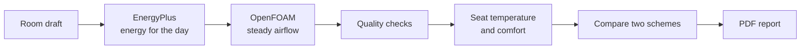
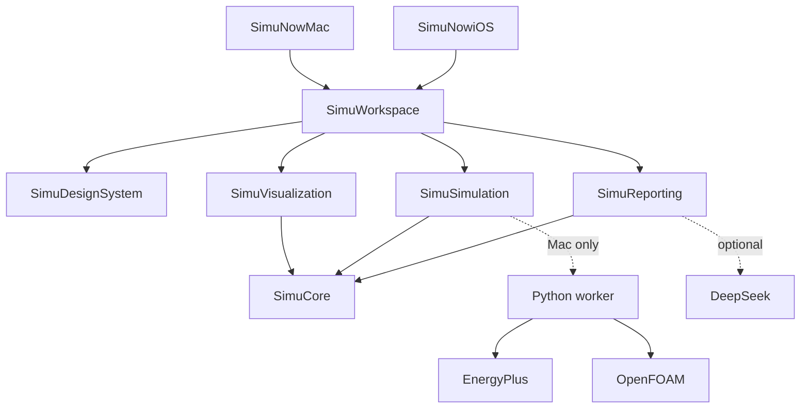

<p align="center">
  
</p>

<h1 align="center">SimuNow</h1>

<p align="center">
  <strong>Same electricity bill. So why is one person sweating and another sitting in a cold draft?</strong><br>
  SimuNow shows you, seat by seat, before you install or adjust the air conditioner.<br><br>
  English · <a href="README.zh-CN.md">中文</a>
</p>

---

Draw an office or classroom, place the seats, furniture, and a split air conditioner, and SimuNow answers two questions about that one room:

- **What does a day of cooling cost?** EnergyPlus works out the cooling, the electricity, and the bill for a typical day.
- **How does each seat feel?** OpenFOAM simulates how the air settles, then reports the temperature and comfort at every seat.

Then put two layouts side by side, say the outlet at 2.1 m versus 2.6 m, and export a PDF that explains the difference.


<!-- Screenshot: two schemes compared side by side -->
<!-- Screenshot: exported comparison PDF -->

## Why we built it

Most people choose and tune an air conditioner by its wattage and whether the room "feels cool." But whether the outlet sits a little higher, whether a desk faces straight into the airflow, and whether a cabinet blocks the return vent barely change the bill. They do change how it feels to sit there.

Look only at the bill and you can't see who is stuck in a hot spot or a draft. SimuNow puts both questions on the same room model, calculates them separately, and shows them together.

## We don't make up numbers

Simulation tools make it easy to print a conclusion that looks good and doesn't hold up. SimuNow deliberately doesn't:

| What you often hear | What SimuNow does |
|---|---|
| "Simulate one day, save X a year" | Reports one typical day only. Any yearly figure is clearly labelled as a rough day × 365 |
| "The room averages 25 °C, so everyone's comfortable" | Reads the temperature at each seat. If the simulation fails its checks, no temperature is shown at all |
| "90% of seats are satisfied" | That ratio only counts seats that pass in the model. It is not a survey of real people |
| "The upgrade pays for itself in 2 years" | Without a real quote, cost says "awaiting quote." No invented prices or payback periods |

## How it works



1. **One room draft.** Size, headcount, working hours, the AC's supply and return vents, the electricity price, and comfort assumptions all live in one `.simunow` project. Setpoint, supply-air temperature, cooling, power, airflow, and air speed are separate fields, never lumped together.
2. **Energy first.** EnergyPlus 25.2 calculates cooling, power, and the bill for a typical day (Hong Kong, 15 July by default). No electricity price means no bill shown, not a zero.
3. **Then airflow.** OpenFOAM v2512 solves the steady airflow using that day's heat from windows and walls. Seat temperatures, a sitting-height temperature map, and airflow lines appear only once the mesh, convergence, and energy-balance checks pass. Change the date and you rerun the energy step first.
4. **Comfort.** Comfort scores follow ISO 7730 (PMV/PPD). They need air temperature, radiant temperature, air speed, humidity, clothing, and activity. If any one is missing, the seat says "can't evaluate."
5. **Report.** DeepSeek writes the report text from the frozen results. Any number it adds that isn't in those results gets removed automatically.

## Try it

**Just the app, no engines.** Enough to browse the interface and lay out a room.

```bash
git clone https://github.com/krabbypatty1031-blip/SimuNow.git
cd SimuNow
open SimuNow.xcodeproj
```

Run **SimuNowMac** (or **SimuNowiOS** on a simulator) and start from the office or classroom template. You need Xcode 16+, macOS 14 / iOS 17+. The 3D view needs macOS 15 / iOS 18; older systems show a 2D wireframe. Without engines the compute buttons stay disabled and tell you why.

**Real calculations (Apple Silicon Mac only).** You also need Docker Desktop running, plus `python3`, `curl`, and `tar`.

```bash
test/engines/install_engines.sh   # once; engines are not committed to Git
export SIMUNOW_ENGINES_ROOT="$PWD/test/engines"
PYTHONPATH=Backend/src python3 -m simunow_worker doctor
```

When `doctor` reports L1 and L2 as `configured`, run **SimuNowMac** in the **Debug** configuration and select the `test/engines` folder under Compute setup in the app.

**PDF report with advice (optional).** Put a DeepSeek API key in `DEEPSEEK_API_KEY`, or save it in the Keychain as `app.simunow.report`.

## What works today

**Ready:** build a room from the office or classroom template; place doors, windows, seats, furniture, and vents; calculate the day's energy and seat-level airflow on a Mac; compare two schemes side by side; export the PDF; switch between Chinese and English; ask the in-app assistant what the current numbers mean.

**Not yet:**

- Running the engines inside the release build (Debug only for now)
- Calculating on iPhone or iPad (they edit and view only)
- Scanning a room with RoomPlan
- Full-year energy simulation, equipment quotes, payback
- Central AC, multiple rooms, the cool-down after switching on

Detailed progress lives in [Plans/Delivery/status.md](Plans/Delivery/status.md).

## For contributors

Two native apps share one local Swift package. The Python worker only runs on the Mac.



| Module | Does | Doesn't |
|---|---|---|
| **SimuCore** | Room draft, coordinates, run identity, metrics | UI, processes, solvers |
| **SimuSimulation** | Submit and cancel runs, event stream | Views, hardcoded paths |
| **SimuDesignSystem** | Colors, type, empty states, accessibility | Physics |
| **SimuVisualization** | 3D / wireframe view, temperature maps, airflow lines | Loads or recommendations |
| **SimuReporting** | Evidence pack, number check, PDF | Recalculating metrics |
| **SimuWorkspace** | Navigation, editing, comparison, export | Calling OpenFOAM directly |
| **Backend** | Turning the room into EnergyPlus / OpenFOAM inputs, running them, quality checks, comfort, cost | Downloading engines at launch |

```bash
Scripts/check.sh test   # shared package tests
Scripts/check.sh mac    # Mac Debug build, signing off
Scripts/check.sh ios    # iOS Simulator build, signing off
Scripts/check.sh all
```

New Swift files go under `Packages/SimuKit/Sources/<module>/`, where SwiftPM finds them automatically. If you change an app target or build setting, update `Scripts/generate_project.py` and regenerate the project. Don't commit build output, simulation data, real room photos, keys, or signing files.

Start with [AGENTS.md](AGENTS.md), the [plan index](Plans/README.md), and the [architecture notes](Plans/References/02-architecture.md).

## References

[EnergyPlus](https://github.com/NREL/EnergyPlus/releases) · [OpenFOAM](https://doc.openfoam.com/) · [ISO 7730](https://www.iso.org/standard/39155.html)
