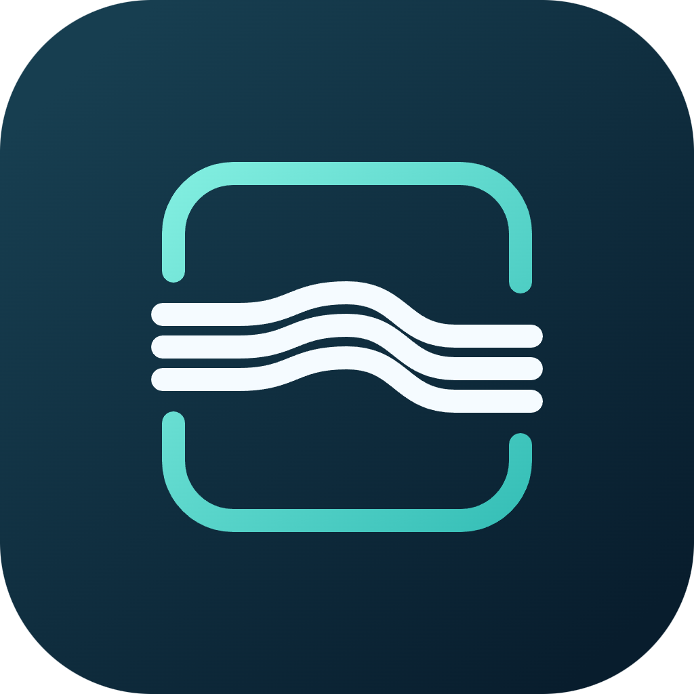
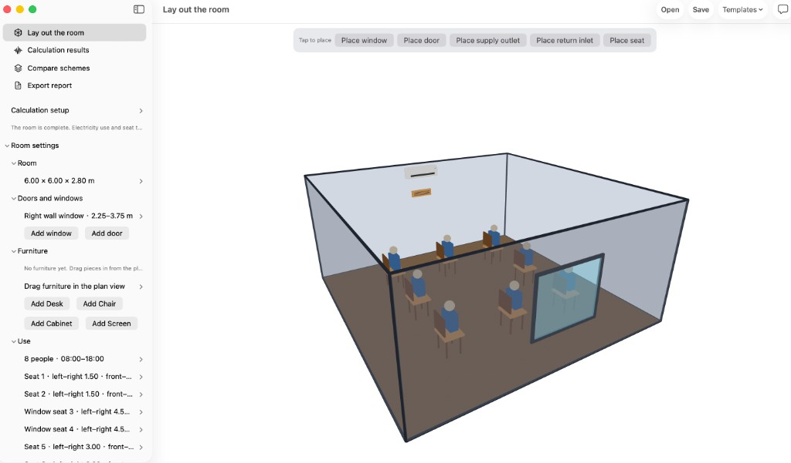
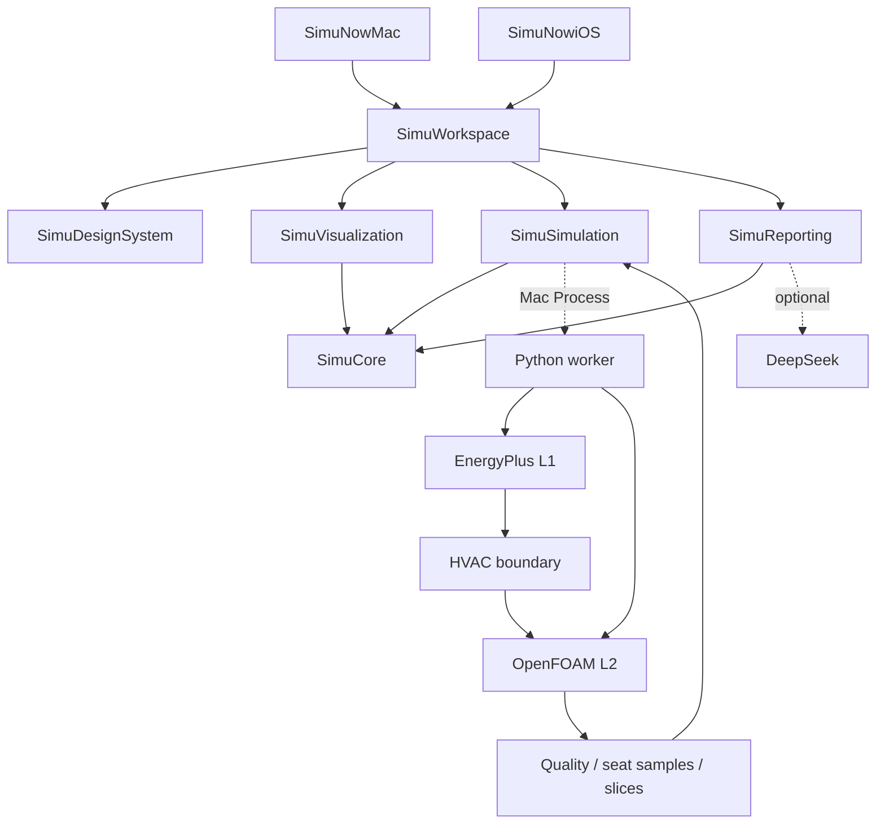

<p align="center">
  
</p>

<h1 align="center">SimuNow</h1>

<p align="center">
  <strong>Draw one room. See what the air conditioner really does — to the bill and to every seat.</strong><br>
  <a href="README.zh-CN.md">中文</a>
  ·
  <a href="https://github.com/krabbypatty1031-blip/SimuNow">GitHub</a>
</p>

---

SimuNow is a **Mac-first app** (iPhone / iPad build for editing and review) where you draw a single office or classroom, place seats, furniture, and a split air conditioner — and get two answers on that same draft:

- **What this day costs to run.** A representative-day energy and bill model (EnergyPlus 25.2).
- **How each seat feels.** Steady-state CFD (OpenFOAM v2512) sampling the temperature at every seat, plus a sitting-height slice and illustrative streamlines.

Pin two schemes side by side and export an evidence-backed comparison PDF.



> Numerical engines run only in the **Mac Debug** build. iPhone and iPad never run EnergyPlus or OpenFOAM locally.

## What it can tell you

- How much electricity — and money — this representative day's cooling takes.
- Whether each seat is warm or cool, and whether anyone sits in a draft or behind blocking furniture.
- Whether moving the supply outlet 0.5 m higher is worth it: two schemes compare **only** on the same weather, occupancy, hours, and cost basis.

## Quick start

You need Xcode 16 or newer and macOS 14 / iOS 17 or newer. The 3D RealityKit viewport needs macOS 15 / iOS 18; older systems fall back to a 2D wireframe. To actually run the physics (Mac only): Docker Desktop running, plus local `python3`, `curl`, and `tar`.

1. Clone and open `SimuNow.xcodeproj`.

   ```bash
   git clone https://github.com/krabbypatty1031-blip/SimuNow.git
   cd SimuNow
   ```

2. Install the engines once (the app never downloads them at launch).

   ```bash
   # Docker daemon must already be running
   test/engines/install_engines.sh
   export SIMUNOW_ENGINES_ROOT="$PWD/test/engines"
   PYTHONPATH=Backend/src python3 -m simunow_worker doctor
   ```

   `doctor` should report L1 / L2 as `configured`. If an engine is missing it prints a repair path — it does not download anything.

3. In Xcode run the shared **SimuNowMac** scheme, destination **My Mac**, configuration **Debug**. On the first compute, point the app at the `test/engines` folder. With no engines configured, compute buttons stay disabled and say why — that is expected, not a bug.

**Optional — advisor PDF.** A DeepSeek API key unlocks the narrative report. It is read from `DEEPSEEK_API_KEY` or `SIMUNOW_REPORT_API_KEY`, then Keychain `app.simunow.report`, then `~/Library/Application Support/SimuNow/deepseek_api_key`. Do not commit the key.

Room inputs are entered in the app itself — the office and classroom templates work out of the box; no prior files required.

## How it works

One `.simunow` project package holds the room, occupancy, openings, tariff, and comfort assumptions. From that single draft:

1. **L1 — representative day (EnergyPlus 25.2).** A single-zone equivalent ideal-loads model plus COP writes cooling watts and electric watts. The weather day is a chosen calendar day on the Hong Kong typical year (default 07-15), not a live forecast. Occupied hours become a schedule, not always-on. Missing weather, tariff, or power omits the figure instead of writing zero.
2. **L2 — airflow (OpenFOAM v2512, steady `buoyantBoussinesqSimpleFoam`).** Only a **current** L1 feeds that day's window and wall heat into the airflow boundaries — a missing or stale L1 never invents weather flux. Seat temperatures, slices, and streamlines appear only after the mesh, convergence, mass, and energy gates pass. Furniture enters as blocked cells; it does not enter the electricity ledger. After changing the date, rerun L1 before L2; seats do not update on their own.
3. **Seat comfort.** A self-contained ISO 7730 Annex D implementation. Air temperature, radiation, speed, humidity, clothing, and activity are all required; anything missing or out of range reports "not evaluable" — never a made-up PMV.
4. **Comparison and report.** Run success, quality, and freshness are independent flags. DeepSeek writes the four narrative sections from a **frozen evidence pack**; a number guard drops any ΔT, kWh, or percentage that is not in the evidence; the appendix is assembled locally. Layout is HTML/CSS rendered through WKWebView.



| Level | Engine | Question | Status |
|---|---|---|---|
| L1 | EnergyPlus | How much cooling and electricity does this day need? | Wired on Mac Debug |
| L2 | OpenFOAM | After the room settles, how does each seat feel? | Wired on Mac Debug |
| L0 / L3 | Fast estimate / surrogate | Screening or interpolation | **Not configured** — never presented as CFD |

The shared model is metric, right-handed, Z-up. Apple display coordinates convert to compute coordinates in one place.

## How we avoid overclaiming

HVAC tools earn trust by refusing shortcuts. These are deliberate product decisions, not disclaimers:

| Common shortcut | What SimuNow does |
|---|---|
| Treat one simulated day as proven annual savings | Day energy and bill are booked on their own; any "yearly" figure is a day × 365 demonstration, not an EnergyPlus annual run |
| Treat a room-average temperature as comfort at every seat | Seat temperatures come from OpenFOAM cell samples; failed quality gates omit temperatures; missing comfort inputs never write PMV = 0 |
| Call "share of passing seats" a measured satisfaction rate | The ratio is model-gate coverage, not a survey or sensor study |
| Invent payback without a quote | Retrofits stay "awaiting quote"; no fabricated equipment prices or payback years |

## What works — and what does not

**Shipped:** create a project from the office or classroom template; place openings, seats, furniture, and supply/return in the inspector and viewport; submit L1 and L2 from Mac Debug; read seat temperatures, slices, and illustrative flow after quality passes; compare two same-basis candidates; export an advisor PDF; switch the UI between Chinese and English; ask the in-app assistant about the current numbers.

**Not shipped — do not describe these as done:**

- Executing EnergyPlus / OpenFOAM inside the Release sandboxed app (the production path is still a signed helper)
- On-device solves on iPhone / iPad
- RoomPlan capture
- L0 screening or L3 surrogate models
- A true annual EnergyPlus run, equipment quotes, or payback
- Central plant, multi-room, or start-up cool-down transients

Stage status lives in [Plans/Delivery/status.md](Plans/Delivery/status.md); architecture decisions in [Plans/Delivery/decisions.md](Plans/Delivery/decisions.md).

## For contributors

Two native app targets share one local Swift package; the Python worker runs only on Mac. Core stays at the bottom, Workspace at the top; engines and renderers are replaceable.

| Module | Owns | Must not |
|---|---|---|
| **SimuCore** | Draft, coordinates, run identity, metrics and provenance | UI, Process, solvers |
| **SimuSimulation** | Submit / cancel, event stream, local execution adapters | Views or hardcoded Desktop paths |
| **SimuDesignSystem** | Semantic color, type, empty states, accessibility | Physics rules |
| **SimuVisualization** | Wireframe / RealityKit viewport, slices, streamlines | Loads or recommendations |
| **SimuReporting** | Evidence pack, number guard, PDF | Recomputing metrics |
| **SimuWorkspace** | Navigation, editing, compare, export | Calling OpenFOAM directly |
| **Backend** | IDF / case translation, job orchestration, quality, comfort, cost | Downloading engines at app launch |

```bash
Scripts/check.sh test  # shared package contract tests
Scripts/check.sh mac   # Mac Debug build, signing off
Scripts/check.sh ios   # generic iOS Simulator build, signing off
Scripts/check.sh all
```

No remote Swift dependencies. The scripts honor `DEVELOPER_DIR` when set (otherwise `/Applications/Xcode.app/Contents/Developer`) and never touch the system `xcode-select`. Build products go to a temp `SimuNow-build-*` directory unless `SIMUNOW_BUILD_DIR` is set.

```text
SimuNow.xcodeproj/    Two app targets and shared schemes
Apps/                 Mac / iOS entries, assets, entitlements
Packages/SimuKit/     Core / Simulation / Design / Viz / Reporting / Workspace
Configurations/       Shared and per-platform build settings
Backend/              Python worker: translation, jobs, quality, comfort
Protocols/            Shared Swift / Python JSON schemas
Fixtures/             Sourced anonymous test fixtures
test/engines/         Engine install scripts (binaries are not committed)
Scripts/              Project generation and check.sh
Plans/                Product, architecture, phases, delivery notes
AGENTS.md             Guide for AI agents working in this repo
```

New Swift feature files go under `Packages/SimuKit/Sources/<module>/` and SwiftPM picks them up. Changing an app entry, target, or build setting means updating `Scripts/generate_project.py` and regenerating the project. Do not commit build products, field data, real room photos, secrets, or signing materials.

## References

- [README (中文)](README.zh-CN.md)
- [Plan index](Plans/README.md) · [Product scope](Plans/References/01-product-scope.md) · [Architecture](Plans/References/02-architecture.md) · [Platform and release](Plans/Delivery/platform-and-release.md)
- [EnergyPlus releases](https://github.com/NREL/EnergyPlus/releases) · [OpenFOAM documentation](https://doc.openfoam.com/) · [ISO 7730](https://www.iso.org/standard/39155.html)
