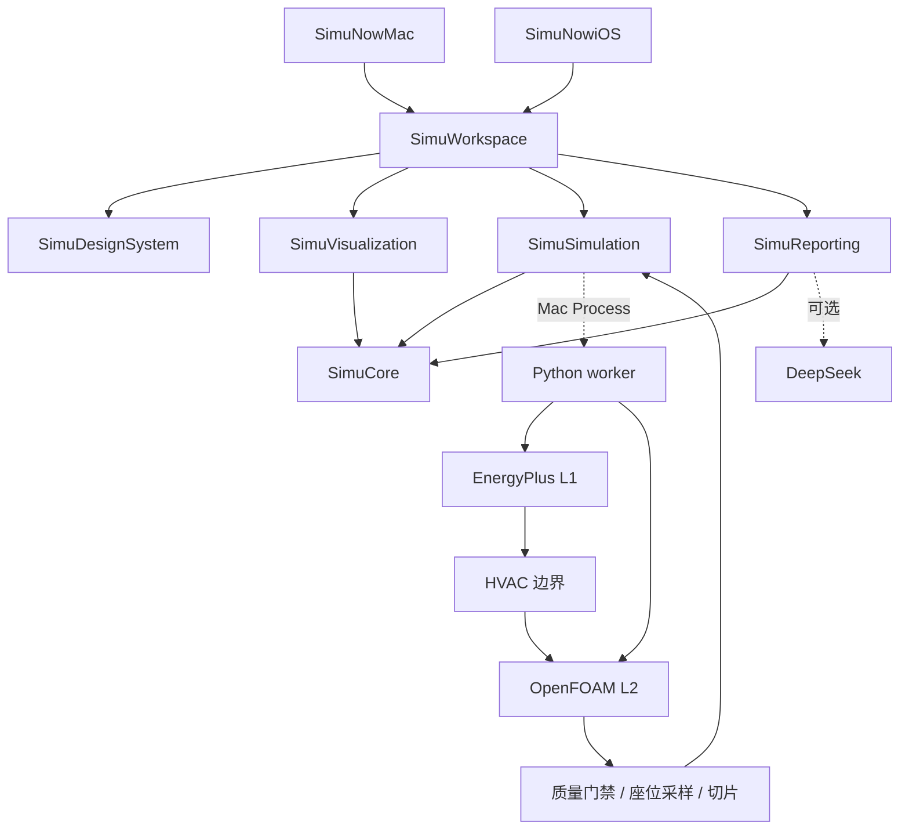
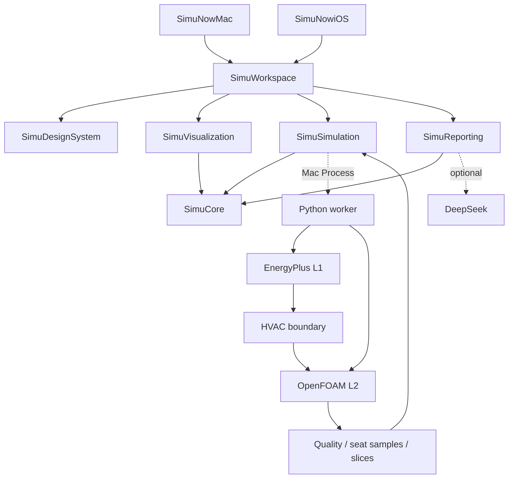

<p align="center">
  
</p>

<h1 align="center">SimuNow</h1>

<p align="center">
  <strong>Mac 优先的室内空调配置与运行分析 App</strong><br>
  用同一房间模型连接 EnergyPlus 用电与 OpenFOAM 气流，比较位置级舒适、电费和可执行建议。
</p>

<p align="center">
  <a href="#simunow-zh">中文</a>
  ·
  <a href="#simunow-en">English</a>
  ·
  <a href="https://github.com/krabbypatty1031-blip/SimuNow">GitHub</a>
</p>

---

<a id="simunow-zh"></a>

# SimuNow（中文）

仓库：[krabbypatty1031-blip/SimuNow](https://github.com/krabbypatty1031-blip/SimuNow)

SimuNow 是一款 **Mac 优先、兼容 iPhone / iPad** 的室内空调方案分析工具。用户在同一个房间草稿里布置门窗、座位、家具和分体空调，先看代表日用电，再看稳态气流下每个座位的温度与体感，最后把两个方案并排放在一起，导出带证据的对比说明。

当前比赛交付已闭环到 **P5**：房间编辑、代表日能耗、座位级 CFD、方案对比、顾问式 PDF。界面默认中文，可切换英文。数值引擎只在 **Mac Debug** 本机执行；iPhone / iPad 用来编辑与查看，不跑本地 EnergyPlus 或 OpenFOAM。

## 我们主要解决什么问题

空调方案往往只凭「看起来凉快」或铭牌功率做决定。送风口高低、座位是不是对着射流、家具会不会挡住回风，这些都会改变人的体感，却常常**不会**改变代表日电费。反过来，只看电费又看不见谁坐在热斑或吹风里。

SimuNow 把这件事拆开，避免三类常见误导：

| 常见做法 | SimuNow 的处理 |
|---|---|
| 用一天模拟直接写全年节能 | 代表日电量与电费单独记账；全年电费若出现，只是代表日 × 365 的演示外推，不是 EnergyPlus 年模拟 |
| 把房间平均温度当成每个座位都舒服 | 座位温度来自 OpenFOAM 网格采样；质量检查未通过不写温度，缺舒适输入不填 PMV = 0 |
| 把「达标座位比例」写成实测满意率 | 比例是模型门覆盖，不是问卷或传感器满意率 |
| 没有报价就写回收期 | 改造费用显示「待报价」，不编造设备价与回收年数 |

首个场景是单房间办公室或教室。一套模型、两种模板、一类分体空调。

## 我们如何实现

价值链是：**空间模型 → 分层物理计算 → 座位评价 → 同口径对比 → 带守卫的报告**。

1. **同一份房间草稿。** 几何、人数、占用时段、送回风口、电价和舒适假设写在一份 `.simunow` 项目包里。设定温度、送风温度、制冷量、电功率、风量和速度分开建模，不混成一个「冷量」。
2. **L1 代表日用电（EnergyPlus 25.2）。** 单区等效理想负荷 + COP，写出冷量瓦特与电功率。占用时段进入日程，不是全天常开。缺天气、缺电价或缺电功率时省略对应数字，不填 0。
3. **L2 代表工况气流（OpenFOAM v2512）。** 稳态浮力求解 `buoyantBoussinesqSimpleFoam`。网格、收敛、质量守恒、能量守恒（含进口面导热）和质量门全部通过后，才采样座位温度、坐姿高度切片和示意流线。家具以阻挡格进入气流，不进入用电账。
4. **座位舒适。** 自实现 ISO 7730 附录 D。需要气温、辐射、风速、湿度、衣着和活动；缺一项或超适用范围显示「不可评价」，不编造舒适分数。
5. **方案对比。** 两个候选必须同一天气、人数、时段和成本口径才能并排比较。任务成功、质量通过、结果是否仍对应当前草稿是三条独立状态。
6. **顾问式 PDF。** DeepSeek 只根据冻结证据包写四节正文（你的两个方案 / 用电对比 / 座位舒适对比 / 建议下一步）。数字守卫丢掉证据之外的 ΔT、kWh、百分比。附录由 App 本地拼装。排版走 HTML/CSS + WKWebView 导出 PDF。

没有配置引擎时，计算按钮不可点，界面明确说明原因。没有 DeepSeek 密钥时，不能导出带顾问正文的有效对比说明。

## 架构

两个原生 App 共用一份本地 Swift 包；Python worker 只在 Mac 侧执行计算。Core 在底层，Workspace 在顶层，引擎与渲染器可替换。



| 模块 | 职责 | 不做什么 |
|---|---|---|
| **SimuCore** | 房间草稿、坐标、run 身份、指标与来源 | UI、Process、求解器 |
| **SimuSimulation** | 提交 / 取消、事件流、本地执行适配 | 直接画界面或写死 Desktop 路径 |
| **SimuDesignSystem** | 语义颜色、排版、空状态、可访问性 | 计算规则 |
| **SimuVisualization** | 线框 / RealityKit 视口、切片、流线 | 热负荷或推荐 |
| **SimuReporting** | 证据包、数字守卫、PDF | 重算指标 |
| **SimuWorkspace** | 导航、编辑、对比、导出工作流 | 直接调用 OpenFOAM |
| **Backend** | IDF / case 转换、求解编排、质量、舒适、费用 | 在 App 启动时下载引擎 |

计算保真度：

| 层级 | 引擎 | 回答的问题 | 当前状态 |
|---|---|---|---|
| L1 | EnergyPlus | 这一天要多少冷量、多少电、多少演示电费 | 已接入 Mac Debug |
| L2 | OpenFOAM | 稳定运行后各座位温湿度感与气流是否合理 | 已接入 Mac Debug |
| L0 / L3 | 快速估算 / 代理模型 | 筛选或插值 | **未配置**，不会包装成 CFD |

公共模型是米制、右手 Z-up。Apple 显示坐标到计算坐标的转换集中管理。iOS 不运行外部 Python、Docker 或 OpenFOAM。

## 如何安装，需要准备什么

### 你需要准备的资料

**看房间、改方案（不必跑引擎）**

- Apple Silicon 或 Intel Mac，或 iPhone / iPad 模拟器
- [Xcode 16](https://developer.apple.com/xcode/) 或更新版本
- macOS 14 / iOS 17 或更新（三维 RealityKit 视口需要 macOS 15 / iOS 18；更低版本回退为二维线框）

**跑真实用电和气流（仅 Mac）**

- 正在运行的 [Docker Desktop](https://www.docker.com/products/docker-desktop/)（OpenFOAM 走 `linux/arm64` 容器）
- 本机 `python3`、`curl`、`tar`（安装脚本会检查）
- 用户选择的引擎目录：EnergyPlus 25.2.0 与天气文件；安装脚本会写入 `test/engines/`（该目录的二进制**不进 Git**）
- 当前官方安装脚本锁定 **Apple Silicon + Darwin arm64 EnergyPlus + linux/arm64 OpenFOAM 镜像**

**导出顾问式对比 PDF（可选）**

- DeepSeek API 密钥。读取顺序：环境变量 `DEEPSEEK_API_KEY` 或 `SIMUNOW_REPORT_API_KEY` → 钥匙串 `app.simunow.report` → `~/Library/Application Support/SimuNow/deepseek_api_key`
- 密钥不要提交到仓库

**房间输入（App 内填写，不必事先准备文件）**

办公室 / 教室模板可直接开用。若要建自己的房间，准备：

- 房间长、宽、高（米）
- 门窗所在墙面与大致尺寸
- 人数、占用时段、座位位置
- 分体机送风口 / 回风口高度与大小
- 电价与币种（没有价格就不显示电费）
- 衣着、活动量、湿度、平均辐射温度假设（缺一项则舒适不可评价）

不要把真实房间照片、密钥或开发者证书放进仓库。

### 安装步骤

1. 克隆仓库，用 Xcode 打开 `SimuNow.xcodeproj`。

```bash
git clone https://github.com/krabbypatty1031-blip/SimuNow.git
cd SimuNow
```

2. 安装计算引擎（只做一次；不会在 App 启动时下载）。

```bash
# 需要本机 Docker daemon 已启动
test/engines/install_engines.sh
export SIMUNOW_ENGINES_ROOT="$PWD/test/engines"
PYTHONPATH=Backend/src python3 -m simunow_worker doctor
```

`doctor` 应报告 L1 / L2 为 `configured`。缺引擎时给出修复路径，不会偷偷下载。

3. 在 Xcode 选择共享 scheme **SimuNowMac**，运行目标选 **My Mac**，使用 **Debug** 配置运行。首次在 App 里用「计算准备」选中刚才的 `test/engines` 文件夹。

4. 真机运行时，在 Signing & Capabilities 选择你自己的 Development Team；必要时改 bundle identifier。

5. 只看界面或在 iPhone / iPad 上编辑房间：选择 scheme **SimuNowiOS** 和已安装的模拟器即可，不必装引擎。

### 开发验证

本地包没有远程 Swift 依赖，打开工程不必下载业务库。共享测试走 SwiftPM；App scheme 目前没有独立 UI 测试 target。

```bash
Scripts/check.sh test  # 共享包契约测试
Scripts/check.sh mac   # Mac Debug 编译，关闭签名
Scripts/check.sh ios   # 通用 iOS Simulator 编译，关闭签名
Scripts/check.sh all
```

脚本优先沿用 `DEVELOPER_DIR`；未指定时使用 `/Applications/Xcode.app/Contents/Developer`，不会改系统 `xcode-select`。构建产物默认进临时目录的 `SimuNow-build-*`，可用 `SIMUNOW_BUILD_DIR` 覆盖。

### 当前能力与边界

已经可以做：从办公室或教室模板建项目；检查器与视口布置门窗、座位、家具、送回风口；Mac Debug 提交代表日 L1 与代表工况 L2；质量通过后看座位温度、切片和示意气流；两列同口径对比；导出顾问式 PDF；中英界面；咨询助手解释当前数字。

尚未交付、不要当成已实现：

- Release 沙盒 App 内执行 EnergyPlus / OpenFOAM（生产路径仍是签名 helper）
- iPhone / iPad 本机求解
- RoomPlan 扫描建房间
- L0 快速估算或 L3 代理模型
- 全年 EnergyPlus 核证、设备报价、回收期
- 中央空调、多房间、瞬态开机降温

更细的阶段状态见 [Plans/Delivery/status.md](Plans/Delivery/status.md)，决策见 [Plans/Delivery/decisions.md](Plans/Delivery/decisions.md)。

## 仓库结构

```text
SimuNow.xcodeproj/    两个 App target 与共享 schemes
Apps/                 Mac / iOS 入口、资源、entitlements
Packages/SimuKit/     Core / Simulation / Design / Viz / Reporting / Workspace
Configurations/       公共与平台构建配置
Backend/              Python worker：转换、求解编排、质量、舒适
Protocols/            Swift / Python 共享 JSON schema
Fixtures/             有来源的匿名测试夹具
test/engines/         引擎安装脚本（二进制不入库）
Scripts/              工程生成与 check.sh
Plans/                产品、架构、阶段与交付记录
AGENTS.md             AI Agent 工作指南
```

新 Swift 功能文件放进 `Packages/SimuKit/Sources/<模块>/`，SwiftPM 会自动发现。改 App 入口、target 或构建配置时同步维护 `Scripts/generate_project.py` 再生成工程。

## 参考

- [计划总入口](Plans/README.md)
- [产品与范围](Plans/References/01-product-scope.md)
- [系统架构](Plans/References/02-architecture.md)
- [平台与交付](Plans/Delivery/platform-and-release.md)
- [Apple 本地包组织](https://developer.apple.com/documentation/xcode/organizing-your-code-with-local-packages)
- [EnergyPlus 发布](https://github.com/NREL/EnergyPlus/releases)
- [OpenFOAM 文档](https://doc.openfoam.com/)
- [ISO 7730](https://www.iso.org/standard/39155.html)

---

<a id="simunow-en"></a>

# SimuNow (English)

Repository: [krabbypatty1031-blip/SimuNow](https://github.com/krabbypatty1031-blip/SimuNow)

SimuNow is a **Mac-first indoor HVAC analysis app** that also builds for iPhone and iPad. You lay out one rectangular room — openings, seats, furniture, and a split air conditioner — on a single draft. The app then answers two different questions on that same draft: what a representative day costs to run, and how each seat feels once the airflow has settled. You pin two schemes side by side and export an evidence-backed comparison.

The competition slice is closed through **P5**: room editing, representative-day energy, seat-level CFD, comparison, and an advisor PDF. The UI defaults to Chinese and can switch to English. Numerical engines run only on **Mac Debug**. iPhone and iPad are for editing and review; they do not run EnergyPlus or OpenFOAM locally.

## The problem we solve

HVAC choices are often made from a catalog wattage or from “it looks cooler.” Outlet height, whether a seat sits in a supply jet, and whether furniture blocks return air can change how people feel **without** changing the representative-day electricity bill — and a bill-only view cannot see who sits in a hot spot or a draft.

SimuNow keeps those questions separate and refuses three common overclaims:

| Common shortcut | What SimuNow does |
|---|---|
| Treat one simulated day as proven annual savings | Day energy and bill are booked on their own. Any “yearly” figure is a representative-day × 365 demonstration, not an EnergyPlus annual run |
| Treat a room-average temperature as comfort at every seat | Seat temperatures come from OpenFOAM cell samples. Failed quality gates omit temperatures; missing comfort inputs never write PMV = 0 |
| Call “share of passing seats” a measured satisfaction rate | The ratio is model-gate coverage, not a survey or sensor study |
| Invent payback without a quote | Retrofits stay “awaiting quote.” No fabricated equipment price or payback period |

The first scene is a single-room office or classroom. One model, two templates, one split-AC type.

## How we implement it

The chain is **spatial model → layered physics → seat evaluation → same-basis comparison → guarded report**.

1. **One project draft.** Geometry, occupancy, occupied hours, supply and return openings, tariff, and comfort assumptions live in a `.simunow` package. Setpoint, supply-air temperature, cooling load, electric power, volume flow, and velocity are separate fields with units.
2. **L1 representative-day energy (EnergyPlus 25.2).** A single-zone equivalent ideal-loads model plus COP writes cooling watts and electric watts. Occupied hours become a compact schedule, not AlwaysOn. Missing weather, tariff, or power omits the related figure instead of writing zero.
3. **L2 representative-condition airflow (OpenFOAM v2512).** Steady buoyant `buoyantBoussinesqSimpleFoam`. Seat temperatures, a sitting-height slice, and illustrative streamlines appear only after mesh, convergence, mass, and energy gates pass (inlet-face conduction is measured and included). Furniture enters L2 as blocked cells. It does not enter the electricity ledger.
4. **Seat comfort.** A self-contained ISO 7730 Annex D implementation. Air temperature, radiation, speed, humidity, clothing, and activity are all required. Missing or out-of-range inputs are “not evaluable.”
5. **Comparison.** Two candidates compare only on the same weather, occupancy, hours, and cost basis. Run success, quality, and freshness are independent flags.
6. **Advisor PDF.** DeepSeek writes four sections from a frozen evidence pack (your two schemes / electricity / seat comfort / what to try next). A narration guard drops any ΔT, kWh, or percentage that is not in the evidence. The appendix is assembled locally. Layout is HTML/CSS rendered through WKWebView.

If engines are not configured, compute actions stay disabled and say why. Without a DeepSeek key, the app will not export an advisor comparison.

## Architecture

Two native app targets share one local Swift package. The Python worker runs only on Mac. Core stays at the bottom; Workspace stays at the top; engines and renderers are replaceable.



| Module | Owns | Must not |
|---|---|---|
| **SimuCore** | Draft, coordinates, run identity, metrics and provenance | UI, Process, solvers |
| **SimuSimulation** | Submit / cancel, event stream, local execution adapters | Views or hardcoded Desktop paths |
| **SimuDesignSystem** | Semantic color, type, empty states, accessibility | Physics rules |
| **SimuVisualization** | Wireframe / RealityKit viewport, slices, streamlines | Loads or recommendations |
| **SimuReporting** | Evidence pack, number guard, PDF | Recomputing metrics |
| **SimuWorkspace** | Navigation, editing, compare, export | Calling OpenFOAM directly |
| **Backend** | IDF / case translation, job orchestration, quality, comfort, cost | Downloading engines at app launch |

Fidelity:

| Level | Engine | Question | Status |
|---|---|---|---|
| L1 | EnergyPlus | How much cooling and electricity does this day need? | Wired on Mac Debug |
| L2 | OpenFOAM | After the room settles, how does each seat feel? | Wired on Mac Debug |
| L0 / L3 | Fast estimate / surrogate | Screening or interpolation | **Not configured** — never presented as CFD |

The shared model is metric, right-handed, Z-up. Apple display coordinates convert to compute coordinates in one place. iOS does not run Python, Docker, or OpenFOAM.

## Install and what to prepare

### What you need

**Inspect the room and edit schemes (no engines)**

- An Apple Silicon or Intel Mac, or an iPhone / iPad Simulator
- [Xcode 16](https://developer.apple.com/xcode/) or newer
- macOS 14 / iOS 17 or newer (the RealityKit 3D viewport needs macOS 15 / iOS 18; older systems keep the 2D wireframe)

**Run real electricity and airflow (Mac only)**

- [Docker Desktop](https://www.docker.com/products/docker-desktop/) running (OpenFOAM uses a `linux/arm64` container)
- Local `python3`, `curl`, and `tar`
- A user-selected engine folder: EnergyPlus 25.2.0 plus the weather file. The install script writes these under `test/engines/` (binaries are **not** in Git)
- The supported install script is pinned to **Apple Silicon, Darwin arm64 EnergyPlus, and a linux/arm64 OpenFOAM image**

**Export an advisor comparison PDF (optional)**

- A DeepSeek API key, read in this order: `DEEPSEEK_API_KEY` or `SIMUNOW_REPORT_API_KEY` → Keychain `app.simunow.report` → `~/Library/Application Support/SimuNow/deepseek_api_key`
- Do not commit the key

**Room inputs (entered in the app; no prior files required)**

Office and classroom templates work out of the box. For your own room, have:

- Length, width, and height in metres
- Which walls hold doors and windows, plus approximate sizes
- Occupant count, occupied hours, and seat positions
- Split-AC supply and return height and size
- Electricity price and currency (no price → no bill)
- Clothing, activity, humidity, and mean radiant temperature assumptions (any missing item → comfort is not evaluable)

Do not commit real room photos, secrets, or signing materials.

### Setup

1. Clone the repo and open `SimuNow.xcodeproj` in Xcode.

```bash
git clone https://github.com/krabbypatty1031-blip/SimuNow.git
cd SimuNow
```

2. Install the engines once. The app will not download them on launch.

```bash
# Docker daemon must already be running
test/engines/install_engines.sh
export SIMUNOW_ENGINES_ROOT="$PWD/test/engines"
PYTHONPATH=Backend/src python3 -m simunow_worker doctor
```

`doctor` should report L1 / L2 as `configured`. If an engine is missing it prints a repair path and does not download anything.

3. In Xcode choose the shared **SimuNowMac** scheme, destination **My Mac**, **Debug**. In the app, use Compute setup to select the `test/engines` folder.

4. For a physical device, pick your own Development Team under Signing & Capabilities and change the bundle identifier if needed.

5. UI-only or iPhone / iPad room editing: run **SimuNowiOS** on an installed Simulator. No engines required.

### Verify a checkout

There are no remote Swift package dependencies. Shared tests run through SwiftPM. App schemes do not currently ship a separate UI-test target.

```bash
Scripts/check.sh test  # shared package contract tests
Scripts/check.sh mac   # Mac Debug build, signing off
Scripts/check.sh ios   # generic iOS Simulator build, signing off
Scripts/check.sh all
```

The scripts honor `DEVELOPER_DIR` when set; otherwise they use `/Applications/Xcode.app/Contents/Developer` and do not change the system `xcode-select`. Build products go to a project-specific `SimuNow-build-*` directory under the temp folder unless you set `SIMUNOW_BUILD_DIR`.

### What works now — and what does not

Shipped: create a project from the office or classroom template; place openings, seats, furniture, and supply/return in the inspector and viewport; submit L1 and L2 from Mac Debug; read seat temperatures, slices, and illustrative flow after quality passes; compare two same-basis candidates; export an advisor PDF; switch the UI between Chinese and English; ask the in-app assistant about the current numbers.

Not shipped — do not describe these as done:

- Executing EnergyPlus / OpenFOAM inside the Release sandboxed app (the production path is still a signed helper)
- On-device solves on iPhone / iPad
- RoomPlan capture
- L0 screening or L3 surrogate models
- A true annual EnergyPlus run, equipment quotes, or payback
- Central plant, multi-room, or start-up cool-down transients

Stage status lives in [Plans/Delivery/status.md](Plans/Delivery/status.md). Architecture decisions live in [Plans/Delivery/decisions.md](Plans/Delivery/decisions.md).

## Repository layout

```text
SimuNow.xcodeproj/    Two app targets and shared schemes
Apps/                 Mac / iOS entries, assets, entitlements
Packages/SimuKit/     Core / Simulation / Design / Viz / Reporting / Workspace
Configurations/       Shared and per-platform build settings
Backend/              Python worker: translation, jobs, quality, comfort
Protocols/            Shared Swift / Python JSON schemas
Fixtures/             Sourced anonymous test fixtures
test/engines/         Engine install scripts (binaries are not committed)
Scripts/              Project generation and check.sh
Plans/                Product, architecture, phases, delivery notes
AGENTS.md             Guide for AI agents working in this repo
```

Add new Swift feature files under `Packages/SimuKit/Sources/<module>/` so SwiftPM picks them up. When you change an app entry, target, or build setting, update `Scripts/generate_project.py` and regenerate the project.

## References

- [Plan index](Plans/README.md)
- [Product scope](Plans/References/01-product-scope.md)
- [Architecture](Plans/References/02-architecture.md)
- [Platform and release](Plans/Delivery/platform-and-release.md)
- [Organizing code with local packages](https://developer.apple.com/documentation/xcode/organizing-your-code-with-local-packages)
- [EnergyPlus releases](https://github.com/NREL/EnergyPlus/releases)
- [OpenFOAM documentation](https://doc.openfoam.com/)
- [ISO 7730](https://www.iso.org/standard/39155.html)
