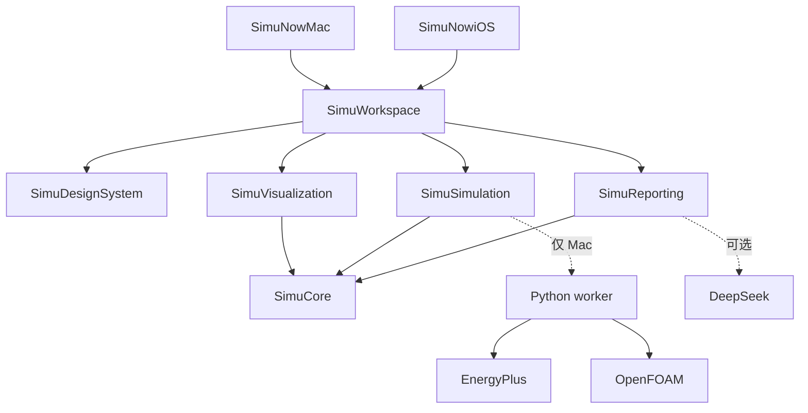

<p align="center">
  
</p>

<h1 align="center">SimuNow</h1>

<p align="center">
  <strong>同样的电费，为什么有人坐着闷热，有人一直被冷风吹？</strong><br>
  装空调、调空调之前，SimuNow 帮你看清每个座位的体感。<br><br>
  <a href="README.md">English</a> · 中文
</p>

---

画一个办公室或教室，摆好座位、家具和分体空调，SimuNow 会回答这个房间的两个问题：

- **开一天空调要花多少电？** 用 EnergyPlus 算出典型一天的制冷量、用电量和电费。
- **每个座位坐着舒不舒服？** 用 OpenFOAM 模拟空气稳定后的流动，给出每个座位的温度和舒适度。

然后把两个方案并排比较，比如送风口装在 2.1 米和 2.6 米，再导出一份讲清差别的 PDF。


<!-- 截图：两个方案并排对比 -->
<!-- 截图：导出的对比 PDF -->

## 为什么做这个

选空调、调空调，大多数人只看功率和「感觉凉不凉快」。但送风口高一点还是低一点、座位是不是正对着风口、柜子有没有挡住回风，几乎不影响电费，却实实在在影响坐在那里的人。

只看电费，你看不见谁坐在热点里、谁一直被风吹。SimuNow 把这两件事放在同一个房间模型里，分开算，一起看。

## 我们不编数字

模拟工具很容易给出一个看起来漂亮、其实站不住的结论。SimuNow 刻意不这样做：

| 常见说法 | SimuNow 的做法 |
|---|---|
| 「模拟一天，全年能省 X 元」 | 只报典型一天的用电和电费。如果出现全年数字，会标明只是「一天 × 365」的粗略推算 |
| 「房间平均 25 °C，大家都舒服」 | 每个座位单独取温度。模拟没通过检查，就一个温度都不显示 |
| 「90% 的座位满意」 | 这个比例只是模型里达标的座位数，不是真人的满意度调查 |
| 「改造后 2 年回本」 | 没有真实报价就写「待报价」，不编设备价格和回收期 |

## 怎么算的


1. **一份房间草稿。** 尺寸、人数、上班时段、空调送回风口、电价和舒适假设，都存在一个 `.simunow` 项目里。设定温度、送风温度、制冷量、电功率、风量、风速分开填写，不混成一个数。
2. **先算用电。** EnergyPlus 25.2 算出典型一天（默认香港 7 月 15 日）的制冷量、电功率和电费。没填电价就不显示电费，而不是显示 0。
3. **再算气流。** OpenFOAM v2512 结合当天窗户和墙体传进来的热量，求解稳态气流。网格、收敛和能量守恒检查都通过后，才显示座位温度、坐姿高度的温度分布图和气流线。改了日期，要先重新算用电。
4. **评价舒适度。** 按 ISO 7730 计算 PMV/PPD，需要气温、辐射温度、风速、湿度、衣着和活动量。缺任何一项，这个座位就显示「无法评价」。
5. **写报告。** DeepSeek 根据冻结的计算结果写报告正文，结果里没有的数字会被自动删掉。

## 上手试试

**只看 App，不装引擎。** 浏览界面、摆房间已经够用。

```bash
git clone https://github.com/krabbypatty1031-blip/SimuNow.git
cd SimuNow
open SimuNow.xcodeproj
```

运行 **SimuNowMac**（或在模拟器上运行 **SimuNowiOS**），从办公室或教室模板开始。需要 Xcode 16 以上、macOS 14 / iOS 17 以上；3D 视图需要 macOS 15 / iOS 18，更低的系统显示 2D 线框。没装引擎时计算按钮不能点，会提示原因。

**跑真实计算（仅 Apple Silicon Mac）。** 还需要正在运行的 Docker Desktop，以及 `python3`、`curl`、`tar`。

```bash
test/engines/install_engines.sh   # 只装一次，引擎不进 Git
export SIMUNOW_ENGINES_ROOT="$PWD/test/engines"
PYTHONPATH=Backend/src python3 -m simunow_worker doctor
```

`doctor` 显示 L1 和 L2 都是 `configured` 后，用 **Debug** 配置运行 **SimuNowMac**，在 App 的「计算准备」里选中 `test/engines` 文件夹。

**带建议的 PDF 报告（可选）。** 把 DeepSeek API 密钥放进环境变量 `DEEPSEEK_API_KEY`，或者存进钥匙串 `app.simunow.report`。

## 现在做到哪了

**已经能用：** 从办公室或教室模板建房间；摆放门窗、座位、家具和风口；在 Mac 上计算当天用电和座位级气流；两个方案并排对比；导出 PDF；中英文界面切换；在 App 里问助手当前数字是什么意思。

**还没做：**

- 正式发布版里直接运行计算引擎（目前只在 Debug 下可用）
- 在 iPhone / iPad 上计算（目前只能编辑和查看）
- 用 RoomPlan 扫描房间
- 全年能耗模拟、设备报价、回收期
- 中央空调、多房间、开机后的降温过程

详细进度见 [Plans/Delivery/status.md](Plans/Delivery/status.md)。

## 参与开发

两个原生 App 共用一个本地 Swift 包，Python 计算端只在 Mac 上运行。



| 模块 | 负责 | 不做 |
|---|---|---|
| **SimuCore** | 房间草稿、坐标、运行身份、指标 | 界面、进程、求解器 |
| **SimuSimulation** | 提交和取消计算、事件流 | 界面、写死路径 |
| **SimuDesignSystem** | 颜色、字体、空状态、无障碍 | 物理计算 |
| **SimuVisualization** | 3D / 线框视图、温度分布图、气流线 | 负荷计算或推荐 |
| **SimuReporting** | 证据包、数字检查、PDF | 重新计算指标 |
| **SimuWorkspace** | 导航、编辑、对比、导出 | 直接调用 OpenFOAM |
| **Backend** | 把房间转成 EnergyPlus / OpenFOAM 输入并运行，做质量检查、舒适度和费用 | 在启动时下载引擎 |

```bash
Scripts/check.sh test   # 共享包测试
Scripts/check.sh mac    # Mac Debug 编译，关闭签名
Scripts/check.sh ios    # iOS 模拟器编译，关闭签名
Scripts/check.sh all
```

新的 Swift 文件放进 `Packages/SimuKit/Sources/<模块>/`，SwiftPM 会自动识别。改了 App target 或构建配置，要同步改 `Scripts/generate_project.py` 并重新生成工程。不要提交构建产物、模拟数据、真实房间照片、密钥或签名文件。

开发前先读 [AGENTS.md](AGENTS.md)、[计划总入口](Plans/README.md) 和 [系统架构](Plans/References/02-architecture.md)。

## 参考

[EnergyPlus](https://github.com/NREL/EnergyPlus/releases) · [OpenFOAM](https://doc.openfoam.com/) · [ISO 7730](https://www.iso.org/standard/39155.html)
