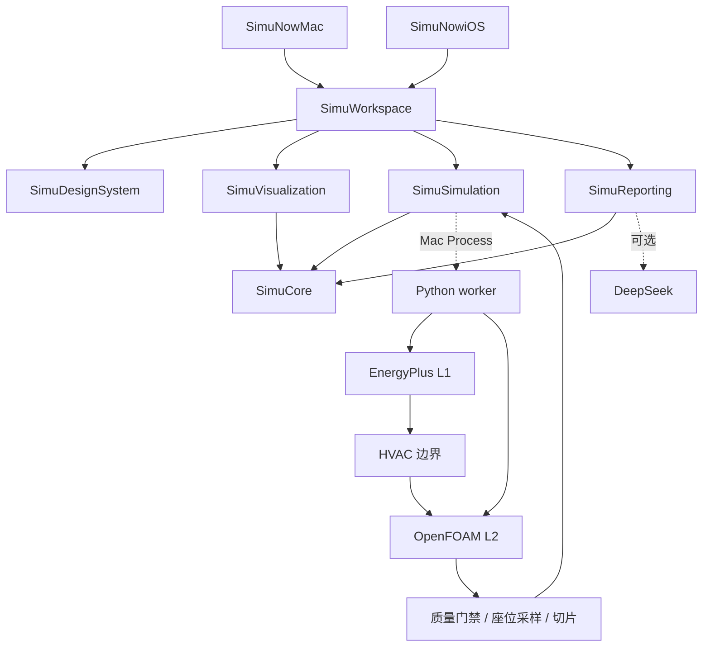

<p align="center">
  
</p>

<h1 align="center">SimuNow</h1>

<p align="center">
  <strong>画一个房间，看清这台空调到底做了什么——对电费、对每个座位。</strong><br>
  <a href="README.md">English</a>
  ·
  <a href="https://github.com/krabbypatty1031-blip/SimuNow">GitHub</a>
</p>

---

SimuNow 是一款 **Mac 优先的 App**（iPhone / iPad 版用于编辑和查看）：画一个办公室或教室，摆好座位、家具和分体空调，在同一份草稿上得到两个答案：

- **这一天开下来要用多少电。** 代表日能耗与电费模型（EnergyPlus 25.2）。
- **每个座位是什么体感。** 稳态 CFD（OpenFOAM v2512）逐座位采样温度，附坐姿高度切片和示意流线。

把两个方案并排放，导出一份带证据的对比 PDF。


> 数值引擎只在 **Mac Debug** 构建中运行。iPhone / iPad 不在本机跑 EnergyPlus 或 OpenFOAM。

## 它能告诉你什么

- 这一天制冷要用多少电、花多少钱。
- 每个座位是热是凉、有没有人正对着风口、有没有人被家具挡住气流。
- 送风口抬高 0.5 米值不值：两个方案**只在**同天气、同人数、同时段、同成本口径下对比。

## 快速开始

需要 Xcode 16 及以上、macOS 14 / iOS 17 及以上。三维 RealityKit 视口需要 macOS 15 / iOS 18，更低版本回退为二维线框。要真正跑物理计算（仅 Mac）：Docker Desktop 已启动，本机有 `python3`、`curl`、`tar`。

1. 克隆仓库，用 Xcode 打开 `SimuNow.xcodeproj`。

   ```bash
   git clone https://github.com/krabbypatty1031-blip/SimuNow.git
   cd SimuNow
   ```

2. 安装计算引擎（只做一次；App 不会在启动时下载）。

   ```bash
   # 需要本机 Docker daemon 已启动
   test/engines/install_engines.sh
   export SIMUNOW_ENGINES_ROOT="$PWD/test/engines"
   PYTHONPATH=Backend/src python3 -m simunow_worker doctor
   ```

   `doctor` 应报告 L1 / L2 为 `configured`。缺引擎时它会给出修复路径，不会偷偷下载。

3. 在 Xcode 选共享 scheme **SimuNowMac**、目标 **My Mac**、配置 **Debug** 运行。首次计算时在 App 里选中 `test/engines` 文件夹。没配引擎时计算按钮不可点并说明原因——这是设计，不是故障。

**可选——顾问式 PDF。** 配一个 DeepSeek API 密钥即可解锁叙述报告。读取顺序：环境变量 `DEEPSEEK_API_KEY` 或 `SIMUNOW_REPORT_API_KEY` → 钥匙串 `app.simunow.report` → `~/Library/Application Support/SimuNow/deepseek_api_key`。密钥不要提交进仓库。

房间数据在 App 里直接填——办公室 / 教室模板开箱即用，不需要事先准备文件。

## 工作原理

一份 `.simunow` 项目包装下房间、人员、门窗、电价和舒适假设。从这份草稿出发：

1. **L1——代表日（EnergyPlus 25.2）。** 单区等效理想负荷 + COP，写出冷量瓦特与电功率。天气日期是香港典型年里选定的一天（默认 07-15），不是实况预报。占用时段进入日程，不是全天常开。缺天气、缺电价或缺电功率时省略对应数字，不填 0。
2. **L2——气流（OpenFOAM v2512，稳态 `buoyantBoussinesqSimpleFoam`）。** **只有当前 L1** 才把当天的窗热、墙热写进气流边界——缺 L1 或 L1 过期时不编造天气热流。网格、收敛、质量、能量守恒全部通过后，才出现座位温度、切片和示意流线。家具以阻挡格进入气流，不进用电账。改了日期要先重跑 L1 再跑 L2；座位不会自己变。
3. **座位舒适。** 自实现 ISO 7730 附录 D。气温、辐射、风速、湿度、衣着、活动量缺一不可；缺项或超适用范围显示「不可评价」，不编造 PMV。
4. **对比与报告。** 任务成功、质量通过、结果新鲜度是三条独立状态。DeepSeek 只根据**冻结证据包**写四节正文；证据之外的 ΔT、kWh、百分比一律丢弃；附录由 App 本地拼装。排版走 HTML/CSS + WKWebView 导出 PDF。



| 层级 | 引擎 | 回答的问题 | 当前状态 |
|---|---|---|---|
| L1 | EnergyPlus | 这一天要多少冷量、多少电？ | 已接入 Mac Debug |
| L2 | OpenFOAM | 房间稳定后每个座位什么体感？ | 已接入 Mac Debug |
| L0 / L3 | 快速估算 / 代理模型 | 筛选或插值 | **未配置**，不会包装成 CFD |

公共模型是米制、右手 Z-up。Apple 显示坐标到计算坐标的转换集中管理。

## 我们如何避免夸大

工具靠拒绝捷径赢得信任。以下是刻意的产品决定，不是免责声明：

| 常见做法 | SimuNow 的处理 |
|---|---|
| 用一天模拟直接写全年节能 | 代表日电量与电费单独记账；任何「全年」数字只是代表日 × 365 的演示外推，不是 EnergyPlus 年模拟 |
| 把房间平均温度当成每个座位都舒服 | 座位温度来自 OpenFOAM 网格采样；质量检查未通过不写温度；缺舒适输入不填 PMV = 0 |
| 把「达标座位比例」写成实测满意率 | 比例是模型门覆盖，不是问卷或传感器满意率 |
| 没有报价就写回收期 | 改造费用显示「待报价」；不编造设备价与回收年数 |

## 当前能力与边界

**已经可以做：** 从办公室 / 教室模板建项目；在检查器与视口布置门窗、座位、家具、送回风口；Mac Debug 提交 L1 与 L2；质量通过后看座位温度、切片和示意气流；两列同口径对比；导出顾问式 PDF；中英界面切换；咨询助手解释当前数字。

**尚未交付，不要当成已实现：**

- Release 沙盒 App 内执行 EnergyPlus / OpenFOAM（生产路径仍是签名 helper）
- iPhone / iPad 本机求解
- RoomPlan 扫描建房间
- L0 快速估算或 L3 代理模型
- 全年 EnergyPlus 核证、设备报价、回收期
- 中央空调、多房间、瞬态开机降温

阶段状态见 [Plans/Delivery/status.md](Plans/Delivery/status.md)，决策记录见 [Plans/Delivery/decisions.md](Plans/Delivery/decisions.md)。

## 贡献者指南

两个原生 App target 共用一份本地 Swift 包；Python worker 只在 Mac 侧执行。Core 在底层、Workspace 在顶层，引擎与渲染器可替换。

| 模块 | 职责 | 不做什么 |
|---|---|---|
| **SimuCore** | 房间草稿、坐标、run 身份、指标与来源 | UI、Process、求解器 |
| **SimuSimulation** | 提交 / 取消、事件流、本地执行适配 | 界面或硬编码 Desktop 路径 |
| **SimuDesignSystem** | 语义颜色、排版、空状态、可访问性 | 计算规则 |
| **SimuVisualization** | 线框 / RealityKit 视口、切片、流线 | 热负荷或推荐 |
| **SimuReporting** | 证据包、数字守卫、PDF | 重算指标 |
| **SimuWorkspace** | 导航、编辑、对比、导出 | 直接调用 OpenFOAM |
| **Backend** | IDF / case 转换、求解编排、质量、舒适、费用 | 在 App 启动时下载引擎 |

```bash
Scripts/check.sh test  # 共享包契约测试
Scripts/check.sh mac   # Mac Debug 编译，关闭签名
Scripts/check.sh ios   # 通用 iOS Simulator 编译，关闭签名
Scripts/check.sh all
```

没有远程 Swift 依赖。脚本优先沿用 `DEVELOPER_DIR`，未指定时使用 `/Applications/Xcode.app/Contents/Developer`，不改系统 `xcode-select`。构建产物默认进临时目录的 `SimuNow-build-*`，可用 `SIMUNOW_BUILD_DIR` 覆盖。

```text
SimuNow.xcodeproj/    两个 App target 与共享 schemes
Apps/                 Mac / iOS 入口、资源、entitlements
Packages/SimuKit/     Core / Simulation / Design / Viz / Reporting / Workspace
Configurations/       公共与平台构建配置
Backend/              Python worker：转换、求解编排、质量、舒适
Protocols/            Swift / Python 共享 JSON schema
Fixtures/             有来源的匿名测试夹具
test/engines/         引擎安装脚本（二进制不入库）
Scripts/              工程生成与 check.sh
Plans/                产品、架构、阶段与交付记录
AGENTS.md             AI Agent 工作指南
```

新 Swift 功能文件放进 `Packages/SimuKit/Sources/<模块>/`，SwiftPM 会自动发现。改 App 入口、target 或构建配置时同步维护 `Scripts/generate_project.py` 再生成工程。不提交构建产物、场数据、真实房间照片、密钥或签名资料。

## 参考

- [README (English)](README.md)
- [计划总入口](Plans/README.md) · [产品与范围](Plans/References/01-product-scope.md) · [系统架构](Plans/References/02-architecture.md) · [平台与交付](Plans/Delivery/platform-and-release.md)
- [EnergyPlus 发布](https://github.com/NREL/EnergyPlus/releases) · [OpenFOAM 文档](https://doc.openfoam.com/) · [ISO 7730](https://www.iso.org/standard/39155.html)
